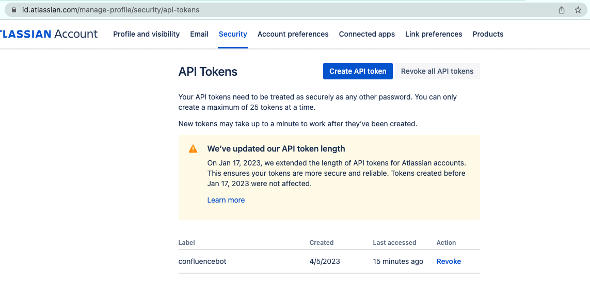
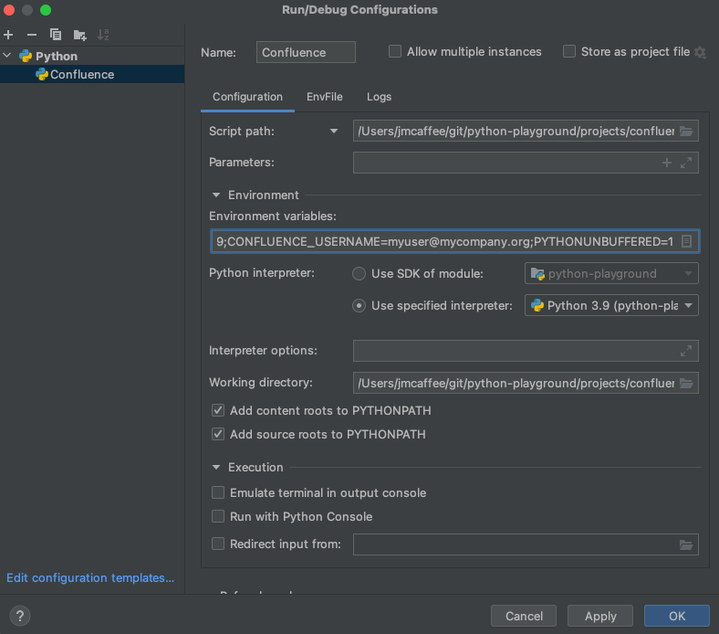

# Overview
Download confluence pages to a database.

Starting at the page title defined [here](https://github.com/jasonmcaffee/python-playground/blob/main/projects/confluence/main.py#L7), 
walk the children pages/nodes, doing depth first, and visit each page, then store the page data (title, page id, parent page id, and html) to the database.

Future iterations of this project can do threads/divide-and-conquer, along with batch updates, but for now simple sequential downloading works pretty well.

## Setup

### pip install
Install dependencies defined in requirements.tx.
```shell
pip install -r requirements.txt
```

### Environment Variables
#### CONFLUENCE_BASE_URL
Your company's url for atlassian.

e.g. https://company-name.atlassian.net
#### CONFLUENCE_USERNAME
Your username for confluence.

e.g. myname@mycompany.org

#### CONFLUENCE_API_TOKEN
Token used to access confluence.

To create a token and get its value, go to [security/api-tokens](https://id.atlassian.com/manage-profile/security/api-tokens)



### Intellij Configuration
Create a run configuration that points to main.py and sets the appropriate env vars.


### Database
Run the db setup script found [here](https://github.com/jasonmcaffee/python-playground/blob/main/projects/confluence/db/db_setup.sql)

It simply creates a new schema called 'confluence' and tables to house confluence date